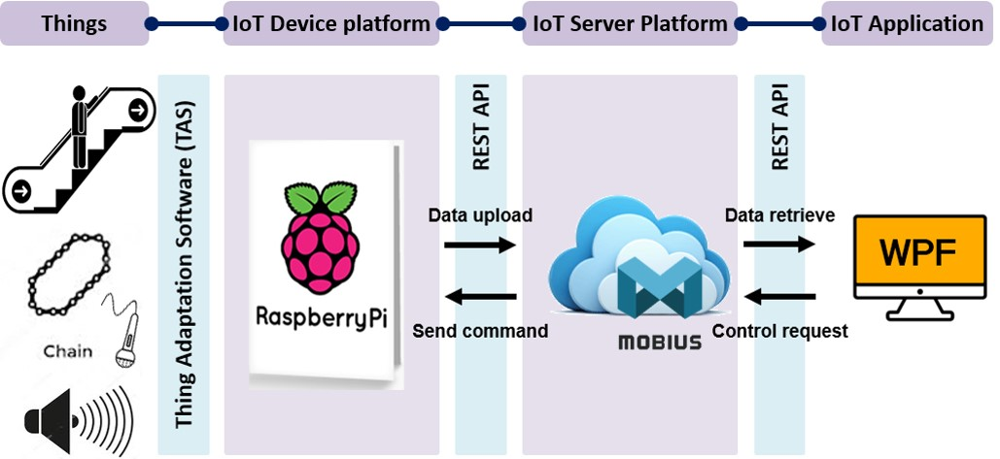
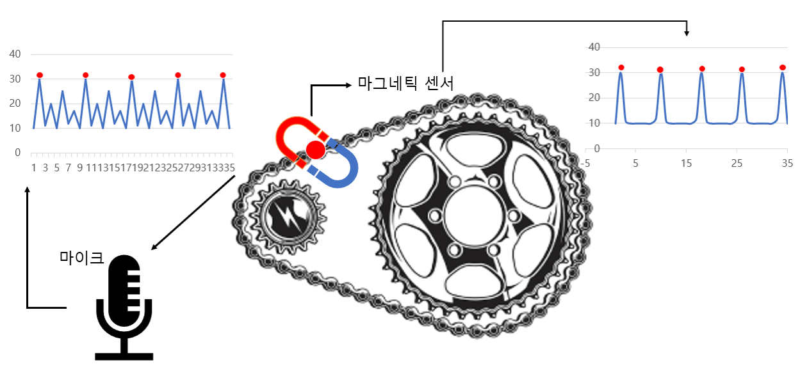

# Anomaly Detection
에스컬레이터에서 소음을 측정하여 서버로 모두 전송하면 데이터 전송과정에서 네트워크의 부하가 일어날 가능성이 크다.  
이를 방지하고 에스컬레이터의 고장 부위와 시기를 정확하게 진단하기위해 이상감지를 한다.  

## System Architecture

## Recording Realtime Noise
실시간으로 소음을 측정하고 이상을 감지하는 기능  
oneM2M 기반으로 명령을 보내 작동을 시작하고 이상이 감지되면 서버에 해당 내용을 전송한다.  

측정한 소음을 wav파일로 변환하고 각각 txt, image로 변환한다.  
변환한 이미지를 이용하여 CNN 모델의 입력데이터로 활용한다.  
최종적으로는 정상과 비정상을 구분하고 결과를 DB에 저장한다.  

## Running Python
게이트웨이에서 실행되는 대다수의 기능은 파이썬 파일로 실행한다.  
파이썬 파일 실행시에 프로세스 ID를 저장하여 종료 명령시, 해당 프로세스를 종료한다. 

## Result
실험 결과는 다음과 같이 준수한 정확도로 정상과 비정상을 구분한다.

## Chain Link
체인의 고장이 발생할 경우, 이상의 여부는 확인이 가능하지만 정확히 어디에 고장이 발생했는지 알 수 없다.  
기준링크라고 하는 체인의 특정 부위를 감지하여 고장 부위를 판단한다.  
  
소음과 마그네틱 데이터를 동시에 취득하여 둘을 비교한 뒤, 기준링크의 위치를 특정하고 해당 부분을 자동화 하는 과정을 진행한다.  
동시취득을 위해 아두이노를 이용하여 GPIO로 명령을 전송한다.  

아두이노와 라즈베리파이의 회로는 위 그림과 같다.  
소음측정장치는 한국콘베어공업에서 제공한 장치를 사용한다.  

