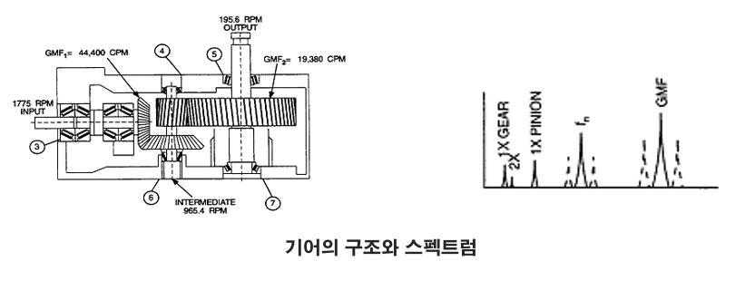

# Chain

## Bandpass Filter
잡음을 없애고 신호를 강조하기 위해 특정 대역폭을 지정하여 필터링을 한다.  
대역통과필터는 Matlab과 비교하여 가장 부합한 라이브러리를 사용한다.  
아래는 왼쪽부터 스텝 체인, 구동 체인의 필터링 결과다.  
  

## Min Variance

## Find Peak

# Gear and Bearing
회전 기계에서 기어는 톱니라고도 불린다.  
기어는 기어와 피니언간 맞물릴때 특정한 소음이 발생한다.  
해당 소음을 기어 맞물림 주파수라고 하고 GMF라고 불린다.  
GMF는 기어의 수명과 직접적인 연관이 있는 요소중 하나이며, 본 연구에서는 GMF를 통해 기어의 잔존수명을 예측하려고 한다.  

베어링 또한 회전 기계에서 중요한 요소이다.  
외륜, 내륜, 볼 베어링 결함이 있으며 베어링 결함시 발생되는 고유한 주파수가 있다.  
해당 대역폭을 포락선 분석을 이용하여 수치화하고 잔존수명을 예측하려고 한다.  

## GAN
  

잔존수명을 예측하기 위해서는 정상 상태부터 완전히 고장 상태가 될 때까지의 방대한 데이터가 필요하다.  
하지만, 현실적인 문제로 데이터 수집이 어려운점이 있다.  
이를 보완하기위해 적대적 생성 신경망인 GAN을 이용하려고 한다.  
GAN의 생성모델을 이용하여 실제데이터와 유사한 더미데이터를 만들어 학습에 활용하려고 한다.  

## 특징 추출
HI 그래프를 그리기 위해서는 수명과 연관된 특징을 추출해야한다.  
  
위 그림과 같이 기어의 내부구조상 기어가 맞물리는 주파수가 발생한다.  
기어의 수명과 관련된 특징은 이 GMF와 조화주파수가 있는데, 본 연구에서는 GMF의 진폭 값을 이용해서 HI 그래프를 그리려고 한다.  

  
베어링의 특징을 추출하기 위해서는 RMS수식을 이용한다.  
베어링의 주파수는 매우 미세하게 발견되기 때문에, 해당 수식을 이용하여 특징을 추출하는 과정을 거친다.    

## CNN
각각의 특징을 이용하여 HI 그래프를 예측하기 위한 입력데이터는 수집했지만, 방대한 빅데이터에서 해당 과정을 반복하기에는 많은 시간이 필요하게 된다.  
  
이를 해결하기 위하여 합성곱신경망인 CNN을 이용하여 정상, 결함 상태에서의 스펙트럼을 입력데이터로 새로운 입력데이터를 분석하는 과정을 거친다.  
(좌 주파수 스펙트럼, 우 첨도 스펙트럼)  

## HI Graph
아래는 위 과정을 통해 출력된 HI 그래프다.  

