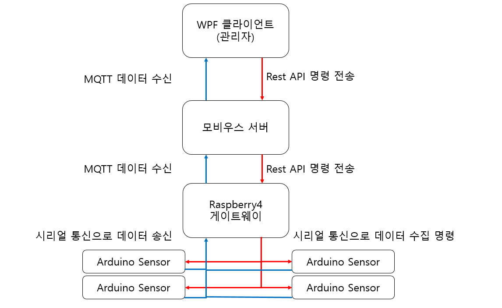

# Demo Program
본 프로젝트의 프로세스의 자동화를 위한 프로그램  
WPF를 서버로 하고 oneM2M을 기반으로 게이트웨이에 명령 전달 및 데이터를 수신한다.  

## System Architecture
  

## REST API
oneM2M 기반으로 모비우스에 REST API에 기반한 명령을 보낸다.  
POST 메시지로 커맨드 명령을 전송한다.  
MQTT 서버를 이용하여 데이터를 수신한다.

## Result
실행화면