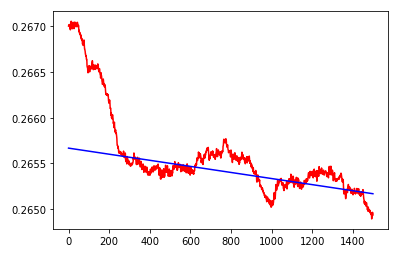

# RUL
에스컬레이터 부품을 교체하는 시기가 사용 환경에 따라 매우 달라지는데 이를 정확하게 알 방법이 없다.  
에스컬레이터의 이상을 감지하여 주요 기계 요소들의 HI 지표를 측정한다.  
측정한 HI 지표를 이용하여 HI 그래프를 그린다.  
최종적으로 RUL 그래프를 그려서 기계의 건전성을 유지한다.  
  
## System Model

## Dependencies
tessorflow 2.0

## Dataset
본 데이터는 한국 콘베어 공업에서 제공받은 현장 데이터와 실험실 데이터다.

Dataset Strcture  

Dataset Example

## Result
Anomaly Dectection

HI Graph

RUL(Remain Useful Life)  
